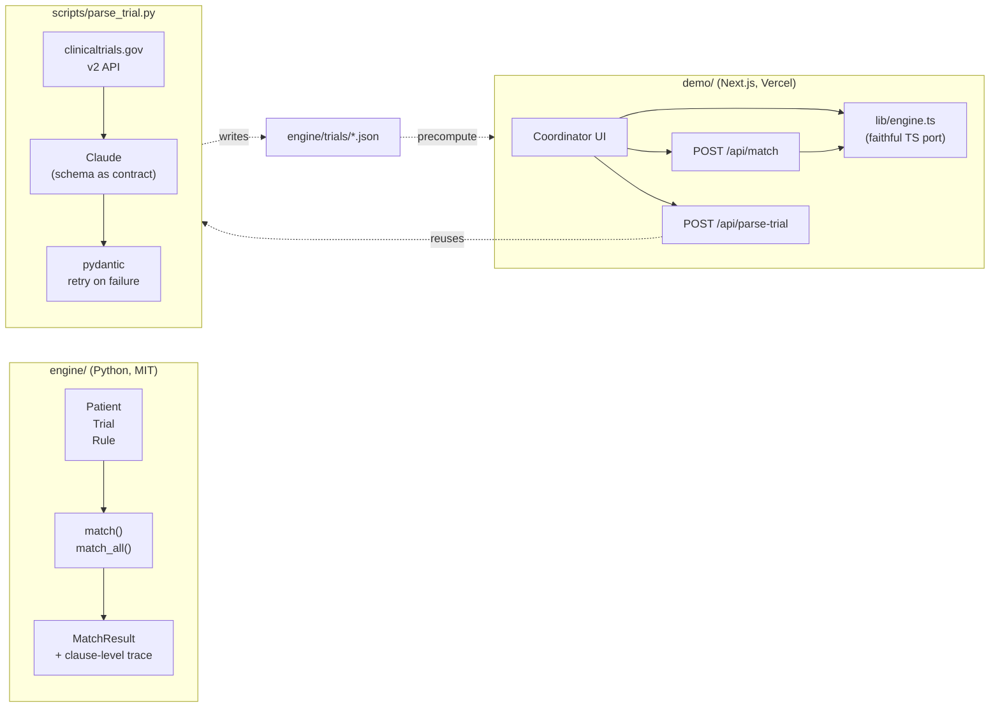

# traumatrial

> Open infrastructure for matching trauma patients to active clinical trials in real time.

**Live demo:** https://traumatrial.vercel.app

Trauma patients die who could have been saved by drugs already in clinical trials, because trials can't enroll fast enough. The consent window for an unconscious patient is minutes, not days. A research coordinator can't comb through 20 active protocols against an arriving patient's vitals while a chest tube is going in.

`traumatrial` is two things in one repo:

- **[`engine/`](engine/)** — `traumatrial-match`, a pure-Python OSS matching engine. MIT-licensed. Evaluates structured trauma trial inclusion/exclusion rules against patient records in <100ms with a clause-level reasoning trace. No web framework, no I/O beyond JSON loaders, no LLM calls in the match path. Embeddable.
- **[`demo/`](demo/)** — a Next.js demo deployed to Vercel showing what real-time eligibility matching looks like from a coordinator's seat. The demo also exposes the engine over a live HTTP API and lets visitors paste any clinicaltrials.gov NCT ID to watch criteria become structured rules in front of them.

The engine is the public infrastructure. The demo is a wedge for trauma research conversations. **Neither contains real patient data — ever.**

## Architecture



The engine is pure functions over pydantic models. The demo's TS port (`demo/lib/engine.ts`) is a faithful mirror — same operators, same trace format, same confidence rubric — so the live `/api/match` produces results indistinguishable from the Python pipeline.

## Quickstart

### Try the live demo

Open https://traumatrial.vercel.app — pick a persona, build a custom patient, or paste any `NCT\d{8}` and watch the engine parse the criteria.

### Embed the engine (Python)

```bash
cd engine
python3 -m venv .venv && source .venv/bin/activate
pip install -e ".[test]"
pytest
```

```python
from traumatrial_match import Patient, Trial, Rule, match

patient = Patient(patient_id="P-001", age_years=34, sex="M", gcs=7,
                  sbp_mmhg=82, hr_bpm=128, mechanism="blunt_mvc",
                  trauma_activation_level=1, eta_minutes=4,
                  pregnancy_status="not_applicable", anticoagulant_use=False,
                  presumed_tbi=True, presumed_hemorrhage=True,
                  presumed_intracranial_hemorrhage=False,
                  spinal_injury_suspected=False)

trial = Trial(trial_id="NCT05638581", short_name="TROOP",
              title="Trauma Resuscitation With Low-Titer Group O Whole Blood",
              requires_efic=True,
              inclusion=[
                  Rule(field="age_years", op="gte", value=15, hard=True),
                  Rule(field="presumed_hemorrhage", op="eq", value=True, hard=True),
              ])

r = match(patient, trial)
print(r.eligible, r.confidence)  # True 1.0
```

See [`engine/README.md`](engine/README.md) for the full API and operator vocabulary.

### Run the demo locally

```bash
cd demo
npm install
npm run dev    # http://localhost:3000
```

The custom-patient form and `/api/match` work with no setup. The NCT parser at `/api/parse-trial` needs `ANTHROPIC_API_KEY` in `.env`.

## Repo layout

```
.
├── engine/                       # Python OSS matching engine
│   ├── traumatrial_match/        # schema.py · match.py · loader.py
│   ├── trials/                   # 10 verified trauma trials (JSON)
│   ├── patients/                 # 8 synthetic personas
│   ├── scripts/
│   │   ├── parse_trial.py        # clinicaltrials.gov → Rule JSON via Claude
│   │   └── precompute.py         # patient × trials → static JSON for demo
│   └── tests/                    # pytest, 29 tests
└── demo/                         # Next.js coordinator-view demo
    ├── app/
    │   ├── page.tsx              # idle / active / parser UI
    │   └── api/
    │       ├── match/route.ts    # live engine (TS port)
    │       └── parse-trial/      # NCT → rules via Claude
    ├── lib/
    │   ├── engine.ts             # TS port of match.py
    │   ├── parseTrial.ts         # TS port of parse_trial.py
    │   └── validateTrial.ts      # mirrors pydantic Rule validator
    └── public/                   # pre-computed match payloads
```

## Status

This is a v0 weekend project, public-facing because the OSS framing is the point.

- Engine matching logic is exercised by 29 pytest tests; trace format is stable.
- Trial JSONs were hand-curated from public clinicaltrials.gov criteria. They are an **approximation, not a clinical decision system**.
- The TS port in `demo/lib/engine.ts` produces identical eligible/confidence/trace output to the Python engine for every patient × trial pair in the bundled corpus.

## What this is NOT

- Not a clinical decision-support system.
- Not validated against real patient data.
- Not regulated, certified, or BAA-able.
- Not a substitute for a research coordinator's clinical judgment.

It is a structured, testable, transparent **starting point** for talking about how trauma trial enrollment could be automated. Treat it that way.

## Why open source

Trial enrollment in trauma is a coordination problem across hospitals, IRBs, EHRs, and trial sponsors. None of those parties want a black box, and none of them want vendor lock-in. Publishing the matching layer as MIT-licensed infrastructure is the only framing that doesn't immediately fail the "would I trust this with my patients" test.

The commercial layer that would sit on top of this — EHR integration, trial sponsor pipelines, regulatory wrapper — is a different conversation, and one the engine has to be public for to make honestly.

## Contributing

See [`CONTRIBUTING.md`](CONTRIBUTING.md). PRs and issues especially welcome from trauma research coordinators, EMS data SMEs, and clinical trial operations folks who can tell us where the schema is wrong.

## License

MIT — see [`LICENSE`](LICENSE).
